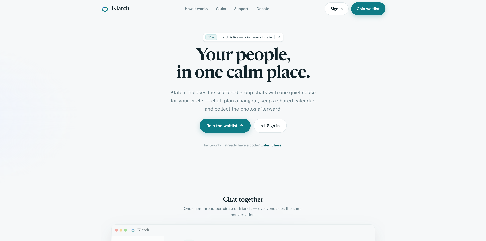

# 🚀 Klatch

> **A modern, secure, and ridiculously awesome project.**

[](#)
[](#)
[](#)
[](#)

---

## ✨ Overview

**Klatch** is a private group chat and planning PWA for a small circle of friends, gated by owner-issued invite codes.

### 🎯 Goals

* ⚡ Fast
* 🔒 Secure
* 🧩 Modular
* 📦 Easy to deploy
* 🛠️ Easy to customize
* 📚 Well documented

---

## 🖼️ Preview

```text
┌──────────────────────────────────────────┐
│                 Klatch                   │
├──────────────────────────────────────────┤
│                                          │
│     🚀 Welcome to the application!      │
│                                          │
│     [ Get Started ]   [ Documentation ]  │
│                                          │
└──────────────────────────────────────────┘
```

<p align="center">
  
</p>

---

## 📋 Table of Contents

* [Features](#-features)
* [Tech Stack](#-tech-stack)
* [Installation](#-installation)
* [Usage](#-usage)
* [Configuration](#-configuration)
* [API](#-api)
* [Security](#-security)
* [Testing](#-testing)
* [Deployment](#-deployment)
* [Roadmap](#-roadmap)
* [FAQ](#-faq)
* [Contributing](#-contributing)
* [License](#-license)

---

# 🌟 Features

| Feature           | Status | Description                |
| ----------------- | :----: | -------------------------- |
| 🔐 Authentication |    ✅   | Secure user authentication |
| 🗄️ Database      |    ✅   | Persistent data storage    |
| ⚡ API             |    ✅   | Fast REST API              |
| 🛡️ Security      |    ✅   | Security-focused defaults  |
| 📊 Analytics      |   🚧   | Currently in development   |
| 🌙 Dark Mode      |    ✅   | Coming soon                |

### Core Features

* [x] User authentication
* [x] API endpoints
* [x] Database integration
* [x] Error handling
* [x] Input validation
* [ ] Advanced analytics
* [ ] Mobile application

---

# 🧰 Tech Stack

### Frontend

```text
React
├── TypeScript
├── CSS
└── Vite
```

### Backend

```text
Node.js
├── Express
├── PostgreSQL
└── Redis
```

### Infrastructure

* ☁️ Cloud hosting
* 🐳 Docker
* 🔄 CI/CD
* 🔐 Environment-based secrets


# 🔒 Security

Security is a first-class concern.

### 🛡️ Recommended protections

* Validate all user input.
* Use parameterized database queries.
* Apply authentication and authorization separately.
* Use secure, HTTP-only cookies for sessions.
* Enable HTTPS in production.
* Keep dependencies updated.
* Store secrets outside source control.
* Configure appropriate security headers.
* Rate-limit sensitive endpoints.
* Log security-relevant events.

### 🚨 Security testing

For an authorized test environment:

```bash
npm audit
```

You can also use a web-application security scanner such as OWASP ZAP against your **own staging environment**.

> **Important:** Only scan systems you own or have explicit permission to test.

---

# 🧪 Testing

```bash
# Unit tests
npm test

# Watch mode
npm run test:watch

# Coverage
npm run test:coverage

# Lint
npm run lint
```


# 🚢 Deployment

### Production checklist

```text
☑ HTTPS enabled
☑ Production secrets configured
☑ Debug mode disabled
☑ Dependencies audited
☑ Database backups enabled
☑ Logging enabled
☑ Monitoring configured
☑ Rate limiting enabled
☑ Security headers configured
☑ Staging tests completed
```

Deploy:

```bash
npm run build
npm start
```

---

# 🗺️ Roadmap

```text
v1.0 ────────► v1.1 ────────► v2.0
 │               │               │
 ▼               ▼               ▼
Core          Analytics       Mobile
API           Dashboard       App
Auth          Monitoring      Scaling
```

### Upcoming

* [ ] 📊 Analytics dashboard
* [ ] 🔔 Notifications
* [ ] 📱 Mobile app
* [ ] 🌍 Internationalization
* [ ] 🤖 Automation
* [ ] 📈 Advanced monitoring


---

# 📜 License

This project is licensed under the **MIT License**.

See [`LICENSE`](LICENSE) for details.

---

# ❤️ Acknowledgements

Built with:

* ❤️ Passion
* 🧠 Curiosity
* 💻 Too many terminal windows

Special thanks to everyone who contributed to the project.

---

## ⭐ Support

If you find this project useful:

> ⭐ **Give it a star!**

Share it, contribute to it, or open an issue if you find something that could be improved.

---

<div align="center">

### 🚀 Made with ❤️ by **critism**

`build • secure • ship • repeat`

</div>
